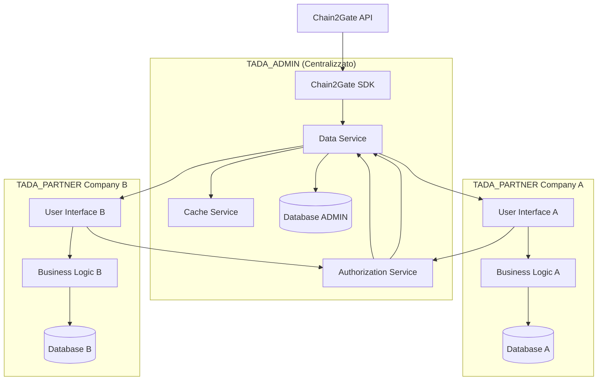

# Design Document

## Overview

Il design propone una ristrutturazione dell'architettura TADA in tre fasi incrementali, partendo dall'attuale "tada_partner" per creare "tada_admin" (modulo centralizzato per gestione Chain2Gate), seguito dalla creazione di TADA_PARTNER (interfaccia utente per singole company). L'architettura finale garantirà sicurezza dei dati multi-company, controllo centralizzato degli accessi e performance ottimizzate.

## Architecture

### Architettura Target



### Fasi di Migrazione

#### Fase 1: "tada_partner" → "tada_admin"
- Rinominare e ristrutturare "tada_partner" come "tada_admin"
- Implementare Authorization Service
- Centralizzare accesso Chain2Gate SDK
- Mantenere tutte le funzionalità esistenti

#### Fase 2: Creazione TADA_PARTNER
- Sviluppare nuovo modulo TADA_PARTNER
- Implementare Service Layer per comunicazione
- Testare integrazione TADA_PARTNER ↔ "tada_admin"

#### Fase 3: Migrazione Funzionalità
- Spostare interfacce utente da "tada_admin" a TADA_PARTNER
- Mantenere solo servizi centrali in "tada_admin"
- Ottimizzare performance e cache

## Components and Interfaces

### "tada_admin" Components

#### 1. Authorization Service
```python
class AuthorizationService(models.AbstractModel):
    _name = 'tada_admin.authorization.service'
    
    def check_company_permission(self, company_id, permission_type):
        """Verifica permessi company per funzionalità specifica"""
        
    def get_authorized_pods(self, company_id):
        """Restituisce lista POD autorizzati per company"""
        
    def validate_pod_access(self, company_id, pod_ids):
        """Valida accesso a specifici POD"""
```

#### 2. Data Service
```python
class DataService(models.AbstractModel):
    _name = 'tada_admin.data.service'
    
    def get_pod_data(self, pod_ids, company_id, data_type):
        """Recupera dati POD filtrati per company"""
        
    def update_pod_data(self, pod_id, data, company_id):
        """Aggiorna dati POD via Chain2Gate"""
        
    def sync_from_chain2gate(self, force_refresh=False):
        """Sincronizza dati da Chain2Gate"""
```

#### 3. Cache Service
```python
class CacheService(models.AbstractModel):
    _name = 'tada_admin.cache.service'
    
    def get_cached_data(self, cache_key):
        """Recupera dati da cache"""
        
    def set_cached_data(self, cache_key, data, ttl=3600):
        """Salva dati in cache con TTL"""
        
    def invalidate_cache(self, pattern):
        """Invalida cache per pattern specifico"""
```

### TADA_PARTNER Components

#### 1. Business Logic Layer
```python
class BusinessLogicService(models.AbstractModel):
    _name = 'tada_user.business.service'
    
    def process_user_request(self, action, params):
        """Elabora richieste utente con validazioni locali"""
        
    def format_display_data(self, raw_data):
        """Formatta dati per visualizzazione utente"""
```

#### 2. API Client
```python
class AdminAPIClient(models.AbstractModel):
    _name = 'tada_user.admin.client'
    
    def call_admin_service(self, service_name, method, params):
        """Client per chiamate a "tada_admin" services"""
        
    def handle_admin_response(self, response):
        """Gestisce risposte da "tada_admin""""
```

### Interface Contracts

#### Service Layer Interface
```python
# "tada_admin" espone questi metodi a TADA_PARTNER
interface AdminServiceInterface:
    def get_monitoring_data(company_id, pod_ids, date_range)
    def get_reporting_data(company_id, filters)
    def update_pod_configuration(company_id, pod_id, config)
    def get_analytics_data(company_id, metrics)
```

## Data Models

### "tada_admin" Data Models

#### Company Permissions
```python
class CompanyPermissions(models.Model):
    _name = 'tada_admin.company.permissions'
    
    company_id = fields.Many2one('res.company', required=True, unique=True)
    has_monitoring = fields.Boolean(default=False)
    has_reporting = fields.Boolean(default=True)
    has_analytics = fields.Boolean(default=False)
    has_advanced_config = fields.Boolean(default=False)
    
    # Audit fields
    created_date = fields.Datetime(default=fields.Datetime.now)
    last_modified = fields.Datetime(auto_now=True)
    modified_by = fields.Many2one('res.users')
```

#### POD Authorization
```python
class PODAuthorization(models.Model):
    _name = 'tada_admin.pod.authorization'
    
    company_id = fields.Many2one('res.company', required=True)
    pod_code = fields.Char(required=True)
    pod_name = fields.Char()
    is_active = fields.Boolean(default=True)
    
    # Chain2Gate sync fields
    chain2gate_id = fields.Char()
    last_sync = fields.Datetime()
    
    _sql_constraints = [
        ('unique_company_pod', 'unique(company_id, pod_code)', 
         'POD can only be assigned to one company')
    ]
```

#### Chain2Gate Data Cache
```python
class Chain2GateDataCache(models.Model):
    _name = 'tada_admin.chain2gate.cache'
    
    cache_key = fields.Char(required=True, index=True)
    data_type = fields.Selection([
        ('monitoring', 'Monitoring Data'),
        ('reporting', 'Reporting Data'),
        ('analytics', 'Analytics Data')
    ])
    cached_data = fields.Text()  # JSON serialized
    created_date = fields.Datetime(default=fields.Datetime.now)
    expires_at = fields.Datetime(required=True)
    pod_codes = fields.Text()  # Comma separated for filtering
```

#### Audit Log
```python
class AuditLog(models.Model):
    _name = 'tada_admin.audit.log'
    
    company_id = fields.Many2one('res.company', required=True)
    user_id = fields.Many2one('res.users', required=True)
    action = fields.Char(required=True)
    resource = fields.Char(required=True)
    resource_id = fields.Char()
    
    # Request details
    request_data = fields.Text()  # JSON
    response_status = fields.Char()
    error_message = fields.Text()
    
    # Timing
    timestamp = fields.Datetime(default=fields.Datetime.now, index=True)
    execution_time_ms = fields.Integer()
```

### TADA_PARTNER Data Models

#### Local Configuration
```python
class UserConfiguration(models.Model):
    _name = 'tada_user.configuration'
    
    company_id = fields.Many2one('res.company', required=True)
    config_key = fields.Char(required=True)
    config_value = fields.Text()
    is_synced_with_admin = fields.Boolean(default=False)
    last_sync = fields.Datetime()
```

## Error Handling

### Error Categories

#### 1. Authorization Errors
```python
class AuthorizationError(Exception):
    """Errori di autorizzazione company/utente"""
    
    def __init__(self, company_id, permission_type, message=None):
        self.company_id = company_id
        self.permission_type = permission_type
        self.message = message or f"Company {company_id} not authorized for {permission_type}"
        super().__init__(self.message)
```

#### 2. Data Access Errors
```python
class DataAccessError(Exception):
    """Errori di accesso ai dati POD"""
    
    def __init__(self, company_id, pod_ids, message=None):
        self.company_id = company_id
        self.pod_ids = pod_ids
        self.message = message or f"Company {company_id} cannot access PODs: {pod_ids}"
        super().__init__(self.message)
```

#### 3. Chain2Gate Integration Errors
```python
class Chain2GateError(Exception):
    """Errori di integrazione con Chain2Gate"""
    
    def __init__(self, operation, status_code, response_data=None):
        self.operation = operation
        self.status_code = status_code
        self.response_data = response_data
        super().__init__(f"Chain2Gate {operation} failed with status {status_code}")
```

### Error Handling Strategy

#### "tada_admin" Error Handling
```python
def handle_service_request(self, service_method, *args, **kwargs):
    try:
        # Log request
        self._log_request(service_method, args, kwargs)
        
        # Execute service
        result = service_method(*args, **kwargs)
        
        # Log success
        self._log_success(service_method, result)
        return result
        
    except AuthorizationError as e:
        self._log_authorization_error(e)
        raise AccessError(e.message)
        
    except DataAccessError as e:
        self._log_data_access_error(e)
        raise ValidationError(e.message)
        
    except Chain2GateError as e:
        self._log_chain2gate_error(e)
        raise UserError(f"External service error: {e.message}")
        
    except Exception as e:
        self._log_unexpected_error(e)
        raise UserError("An unexpected error occurred. Please contact support.")
```

#### TADA_PARTNER Error Handling
```python
def handle_admin_service_call(self, service_call):
    try:
        return service_call()
    except AccessError as e:
        # Mostra messaggio user-friendly per errori di autorizzazione
        raise UserError("You don't have permission to access this feature. Contact your administrator.")
    except ValidationError as e:
        # Mostra errori di validazione all'utente
        raise UserError(f"Data validation error: {e}")
    except UserError as e:
        # Passa attraverso errori utente
        raise e
    except Exception as e:
        # Log errore e mostra messaggio generico
        _logger.error(f"Unexpected error calling admin service: {e}")
        raise UserError("Service temporarily unavailable. Please try again later.")
```
