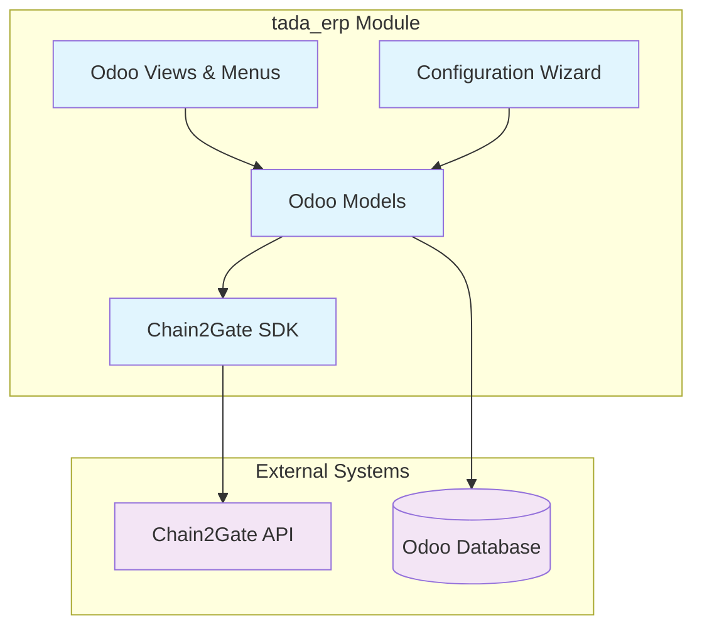

# Design Document

## Overview

The tada_erp module is a simplified version of the chain2gate_integration module that removes all encryption functionality while maintaining the same API integration capabilities and user interface. The module will provide direct access to Chain2Gate IoT energy monitoring data without the complexity of hierarchical encryption, AWS dependencies, or encrypted data storage.

## Architecture

### High-Level Architecture



### Key Architectural Changes from Original

1. **Removed Components:**
   - `chain2gate_encrypted_sdk.py` - Encrypted SDK wrapper
   - `chain2gate_odoo_sdk.py` - Odoo-specific encrypted SDK
   - `hierarchical_encryption.py` - HIBE encryption system
   - `odoo_secure_encryption.py` - Odoo encryption wrapper
   - All AWS Secrets Manager integration
   - All encryption-related mixins and utilities

2. **Simplified Components:**
   - Direct use of `chain2gate_sdk.py` without encryption layers
   - Plain text storage of all personal data fields
   - Simplified configuration wizard without encryption setup
   - Standard Odoo model inheritance without encryption mixins

## Components and Interfaces

### 1. Core SDK Integration

**File:** `tada_erp/models/sdk/chain2gate_sdk.py`
- **Purpose:** Direct copy of the base Chain2Gate SDK without modifications
- **Interface:** Same as original SDK with all dataclasses and methods
- **Dependencies:** Only `requests` library for HTTP calls

### 2. Odoo Model Layer

**Base Mixin:** `tada_erp/models/mixins/dataclass_mixin.py`
```python
class TadaDataclassModelMixin(models.AbstractModel):
    """Simplified dataclass mixin without encryption"""
    _name = 'tada.dataclass.mixin'
    
    # Company isolation fields
    company_id = fields.Many2one('res.company', required=True, default=lambda self: self.env.company)
    
    # Standard audit fields
    created_at = fields.Datetime(string='Created At', default=fields.Datetime.now)
    updated_at = fields.Datetime(string='Updated At', default=fields.Datetime.now)
    
    # SDK integration methods (without encryption)
    def get_sdk_instance(self):
        """Get SDK instance with company-specific configuration"""
        
    def from_dataclass(self, dataclass_instance, company_id=None):
        """Create Odoo record from SDK dataclass"""
        
    def update_from_dataclass(self, dataclass_instance):
        """Update Odoo record from SDK dataclass"""
```

**Customer Model:** `tada_erp/models/odoo_models/customer.py`
```python
class TadaCustomer(models.Model):
    _name = 'tada.customer'
    _inherit = ['tada.dataclass.mixin']
    
    # Plain text fields (no encryption)
    fiscal_code = fields.Char(string='Fiscal Code', required=True, index=True)
    first_name = fields.Char(string='First Name')
    last_name = fields.Char(string='Last Name')
    email = fields.Char(string='Email')
    phone = fields.Char(string='Phone')
    
    # Multi-company constraint
    _sql_constraints = [
        ('fiscal_code_company_unique', 'UNIQUE(fiscal_code, company_id)', 
         'Fiscal code must be unique per company!')
    ]
```

### 3. Multi-Company Security Implementation

**Record Rules:** `tada_erp/security/ir.model.access.csv`
- All models will have record rules that filter by `company_id`
- Domain filters: `[('company_id', '=', user.company_id.id)]`

**Security Groups:**
- `tada_erp_user` - Basic user access
- `tada_erp_manager` - Full access within company
- `tada_erp_admin` - System administration

### 4. Configuration Management

**Configuration Model:** `tada_erp/models/odoo_models/res_company.py`
```python
class ResCompany(models.Model):
    _inherit = 'res.company'
    
    # TADA ERP Configuration
    tada_api_key = fields.Char(string='TADA API Key')
    tada_base_url = fields.Char(string='TADA Base URL', 
                               default='https://chain2-api.chain2gate.it')
    tada_active = fields.Boolean(string='TADA Integration Active', default=False)
```

**Configuration Wizard:** `tada_erp/wizards/tada_config_wizard.py`
```python
class TadaConfigWizard(models.TransientModel):
    _name = 'tada.config.wizard'
    
    api_key = fields.Char(string='API Key', required=True)
    base_url = fields.Char(string='Base URL', required=True)
    
    def test_connection(self):
        """Test API connection without encryption"""
        
    def save_configuration(self):
        """Save configuration to company settings"""
```

## Data Models

### 1. Customer Data Model

```python
@dataclass
class TadaCustomer:
    fiscal_code: str
    first_name: Optional[str] = None
    last_name: Optional[str] = None
    email: Optional[str] = None
    phone: Optional[str] = None
    user_type: Optional[UserType] = None
    group: Optional[str] = None
    company_id: int  # Added for multi-company support
```

### 2. Request Data Models

All request models (Admissibility, Association, Disassociation) will store personal data in plain text:

```python
# Example: Association Request
fiscal_code = fields.Char(string='Fiscal Code', required=True, index=True)
first_name = fields.Char(string='First Name')
last_name = fields.Char(string='Last Name')
email = fields.Char(string='Email')
```

### 3. Device Data Model

Device information remains unchanged as it doesn't contain personal data:

```python
class TadaDevice(models.Model):
    _name = 'tada.device'
    
    device_id = fields.Char(string='Device ID', required=True, index=True)
    du_name = fields.Char(string='DU Name', required=True)
    # ... other device fields remain the same
```

## Error Handling

### 1. API Error Handling

```python
def _handle_api_response(self, response):
    """Handle API responses without encryption error handling"""
    if response.get('error'):
        raise UserError(f"API Error: {response.get('message', 'Unknown error')}")
    return response.get('data')
```

### 2. Multi-Company Validation

```python
def _validate_company_access(self, record):
    """Ensure user can only access their company's data"""
    if record.company_id != self.env.company:
        raise AccessError("Access denied: Record belongs to different company")
```

### 3. Data Validation

```python
def _validate_fiscal_code(self, fiscal_code):
    """Validate fiscal code format and uniqueness within company"""
    if not fiscal_code:
        raise ValidationError("Fiscal code is required")
    
    existing = self.search([
        ('fiscal_code', '=', fiscal_code),
        ('company_id', '=', self.env.company.id),
        ('id', '!=', self.id)
    ])
    if existing:
        raise ValidationError("Fiscal code already exists in this company")
```

## Testing Strategy

### 1. Unit Tests

**Test Structure:**
```
tada_erp/tests/
├── test_models/
│   ├── test_customer.py
│   ├── test_device.py
│   ├── test_requests.py
│   └── test_multicompany.py
├── test_sdk/
│   └── test_sdk_integration.py
└── test_wizards/
    └── test_config_wizard.py
```

**Key Test Cases:**
- Multi-company data isolation
- Plain text data storage and retrieval
- API integration without encryption
- Configuration wizard functionality
- Record rule enforcement

### 2. Integration Tests

```python
class TestMultiCompanyIsolation(TransactionCase):
    def test_customer_isolation_between_companies(self):
        """Test that customers are isolated between companies"""
        
    def test_api_calls_use_company_specific_config(self):
        """Test that API calls use correct company configuration"""
        
    def test_record_rules_enforce_company_boundaries(self):
        """Test that record rules prevent cross-company access"""
```

### 3. Security Tests

```python
class TestSecurityBoundaries(TransactionCase):
    def test_user_cannot_access_other_company_data(self):
        """Test that users cannot access other company's data"""
        
    def test_fiscal_code_uniqueness_per_company(self):
        """Test fiscal code uniqueness within company boundaries"""
```

## Migration Strategy

### 1. Module Structure Migration

1. **Copy Base Structure:** Copy entire `chain2gate_integration` directory to `tada_erp`
2. **Remove Encryption Files:** Delete all encryption-related files
3. **Update Imports:** Remove all encryption-related imports
4. **Rename Models:** Change model names from `chain2gate.*` to `tada.*`

### 2. Data Model Simplification

1. **Remove Encrypted Fields:** Replace `*_encrypted` fields with plain text fields
2. **Update Field Mappings:** Remove encryption field mappings from mixins
3. **Simplify Constraints:** Update unique constraints to use plain text fields

### 3. Configuration Updates

1. **Manifest Updates:** Remove encryption dependencies (cryptography, boto3)
2. **Menu Updates:** Change branding from "Chain2Gate" to "TADA ERP"
3. **View Updates:** Update all view references to new model names

## Deployment Considerations

### 1. Dependencies

**Required Python Packages:**
- `requests` (for API calls)
- Standard Odoo dependencies only

**Removed Dependencies:**
- `cryptography`
- `boto3`
- `botocore`

### 2. Configuration Requirements

**Environment Variables:** None required (no AWS integration)

**Database Setup:**
- Standard Odoo database setup
- No special encryption key storage needed

### 3. Performance Considerations

**Improved Performance:**
- No encryption/decryption overhead
- Faster database queries on plain text fields
- Reduced memory usage without encryption sessions

**Search Optimization:**
- Direct text search on personal data fields
- Standard database indexing on all searchable fields